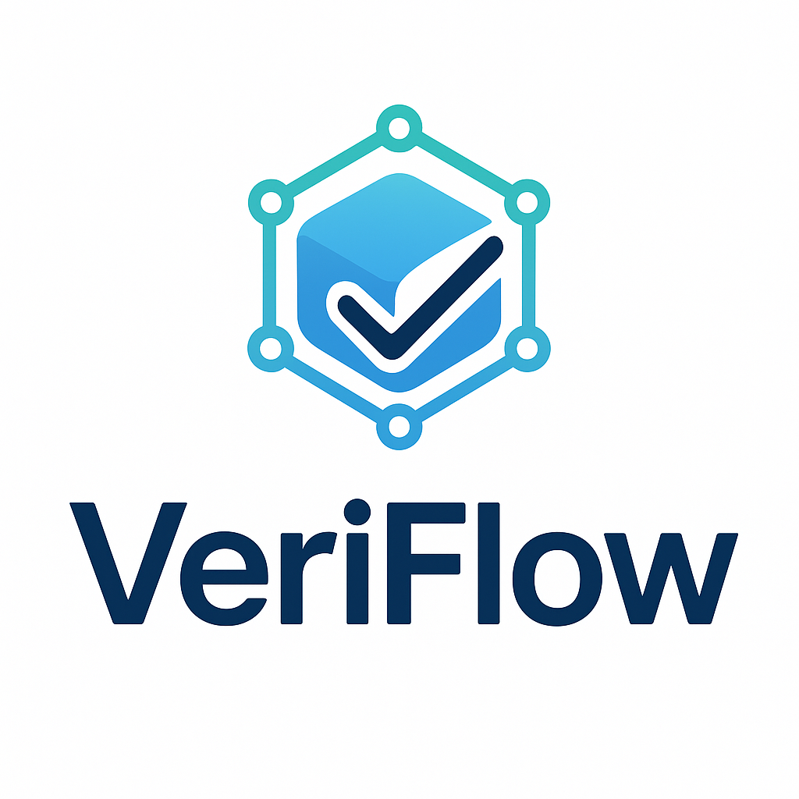

# VeriFlow - The Truth Layer for Supply Chains



## Overview

VeriFlow is a **decentralized verification protocol** that brings trust, transparency, and automation to global supply chains. We create a single, immutable source of truth for provenance, compliance, and logistics data, enabling a new era of efficient and secure international trade.

## Key Features

- **🔗 Immutable Provenance Tracking:** Follow any product from origin to consumer.
- **🤖 Automated Compliance:** Smart contracts auto-verify customs and regulatory documents.
- **🌡️ Trustless IoT Oracle:** Tamper-proof logs of real-world conditions (temperature, shock, etc.).
- **💸 Trade Finance Ready:** Unlock DeFi lending against verifiable in-transit goods.

## Architecture

VeriFlow is built on a **modular blockchain stack** for maximum scalability and security:

1.  **Settlement Layer:** Ethereum Mainnet (Security)
2.  **Execution Layer:** VeriFlow Sovereign Rollup (Custom Logic)
3.  **Data Availability Layer:** 0G (High-Throughput, Low-Cost Data)
4.  **Verification Layer:** zk-SNARKs for privacy-preserving proofs.

## Tech Stack

- **Smart Contracts:** Solidity, Hardhat, Foundry
- **Zero-Knowledge Proofs:** Cairo, StarkWare
- **Data Availability:** 0G
- **Oracles:** Chainlink, Gelato, Custom IoT Oracles
- **Frontend:** React, TypeScript, Tailwind CSS
- **Backend:** Node.js, Express, PostgreSQL
- **Storage:** IPFS, Filecoin

## Getting Started

### Prerequisites
- Node.js (v18 or later)
- Git
- A basic understanding of Ethereum and smart contracts.

### Installation

1.  **Clone the repository:**
    ```bash
    git clone https://github.com/GauravKarakoti/Veriflow.git
    cd protocol-core
    ```

2.  **Install dependencies:**
    ```bash
    npm install
    ```

3.  **Set up environment variables:**
    ```bash
    cp .env.example .env
    # Edit .env with your Infura project ID, private key, etc.
    ```

4.  **Compile contracts:**
    ```bash
    npx hardhat compile
    ```

5.  **Run tests:**
    ```bash
    npx hardhat test
    ```

## Documentation

For comprehensive documentation, including API references, architecture deep-dives, and integration guides, please visit our [GitBook Documentation](https://docs.veriflow.xyz).

## Repository Structure

```text
veriflow-monorepo/
├── packages/
│ ├── contracts/ # Core Solidity smart contracts
│ ├── subgraph/ # The Graph for querying events
│ ├── frontend/ # React dApp interface
│ └── backend/ # Node.js API & oracle services
├── docs/ # Technical documentation
└── README.md
```
## Contact & Links

- **Website:** [https://veriflow.xyz](https://veriflow.xyz)
- **Twitter:** [@GauravKara_Koti](https://x.com/GauravKara_Koti)
- **Telegram:** [GauravKarakoti](https://t.me/GauravKarakoti)
- **Email:** karakotigaurav12@gmail.com

---

**Proudly built for the future of global trade.**
